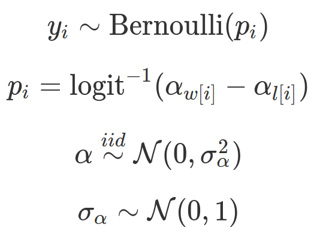
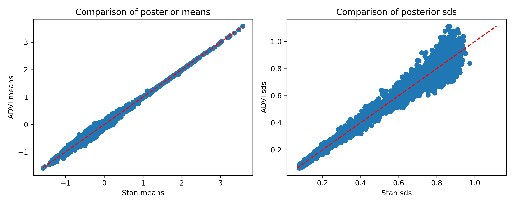
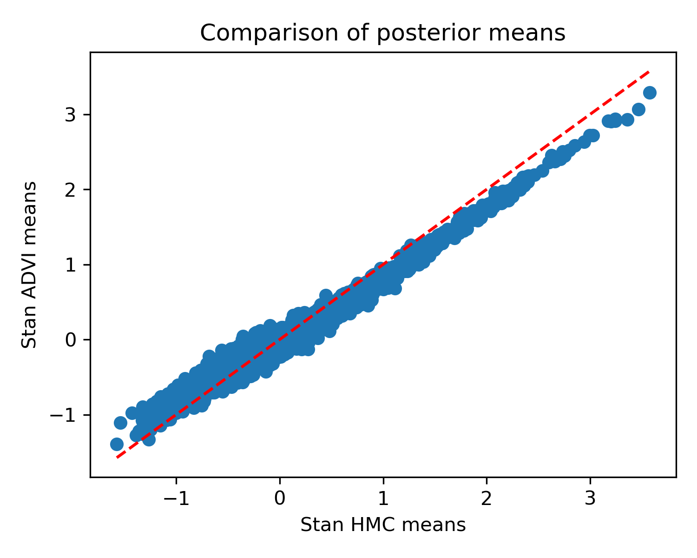

# JAX ADVI

#### What is this?

JAX ADVI is a small library designed to do black-box variational inference using automatic differentiation variational inference ([ADVI](https://jmlr.org/papers/v18/16-107.html)). Specifically, it implements the variant proposed by [Giordano et al.](https://jmlr.org/papers/v19/17-670.html) which allows the use of (approximate) second order methods, which can be more robust. You can read about the methodology [on my blog](https://martiningram.github.io/deterministic-advi/).

#### How do I use it?

##### Installation

To use this library, you'll need [JAX](https://github.com/google/jax). If you want to run the examples, you'll also need:

* Pandas
* Scikit-learn
* Matplotlib
* Pystan

To install, clone this repository and run `python setup.py develop`.

##### Usage

The key function is `optimize_advi_mean_field`. Here's a simple example of a logistic regression:

Model:


Code:
```python
from jax_advi.advi import optimize_advi_mean_field
from jax import jit
from jax.scipy.stats import norm
from functools import partial
from jax.nn import log_sigmoid

# Define parameter shapes:
theta_shapes = {
    'beta': (K),
    'gamma': ()
}

# Define a function to calculate the log likelihood
def calculate_likelihood(theta, X, y):
    
    logit_prob = X @ theta['beta'] + theta['gamma']
    
    prob_pres = log_sigmoid(logit_prob)
    prob_abs = log_sigmoid(-logit_prob)
    
    return jnp.sum(y * prob_pres + (1 - y) * prob_abs)

# Define a function to calculate the log prior
def calculate_prior(theta):
    
    beta_prior = jnp.sum(norm.logpdf(theta['beta']))
    gamma_prior = jnp.sum(norm.logpdf(theta['gamma']))
    
    return beta_prior + gamma_prior
	
# The partial application basically conditions on the data (not defined in this
# little snippet)
log_lik_fun = jit(partial(calculate_likelihood, X=X, y=y))
log_prior_fun = jit(calculate_prior)

# Call the optimisation function
result = optimize_advi_mean_field(theta_shapes, log_prior_fun, log_lik_fun, n_draws=None)
```

JAX ADVI should typically get the means right, but the variances may be off. For a full example comparing against Stan's HMC, see [the example notebook](https://github.com/martiningram/jax_advi/blob/main/examples/Logistic%20regression%20example.ipynb). Here is a comparison for some toy data, taken from that example:


As promised, good means, less reliable standard deviations.

##### Example 2

A more complex example is the following hierarchical model:



You can read a bit more about it in [the blog post](https://martiningram.github.io/deterministic-advi/) if you like. Here's what the code looks like:

Define shapes:

```python
theta_shapes = {
    'player_skills': (n_p),
    'skill_prior_sd': ()
}
```

Constrain the prior standard deviation to be positive:

```python
from jax_advi.constraints import constrain_positive

theta_constraints = {
    'skill_prior_sd': constrain_positive
}
```

Define the log likelihood and prior:

```python
from jax.scipy.stats import norm
from jax import jit
from jax.nn import log_sigmoid
import jax.numpy as jnp

@jit
def log_prior_fun(theta):
    
    # Prior
    skill_prior = jnp.sum(norm.logpdf(theta['player_skills'], 0., theta['skill_prior_sd']))
    
    # hyperpriors
    hyper_sd = norm.logpdf(theta['skill_prior_sd'])
    
    return skill_prior + hyper_sd

def log_lik_fun(theta, winner_ids, loser_ids):
    
    logit_probs = theta['player_skills'][winner_ids] - theta['player_skills'][loser_ids]
    
    return jnp.sum(log_sigmoid(logit_probs))

from functools import partial

curried_lik = jit(partial(log_lik_fun, winner_ids=winner_ids, loser_ids=loser_ids))
```

Finally, optimize:

```python
result = optimize_advi_mean_field(
	theta_shapes, log_prior_fun, curried_lik, 
	constrain_fun_dict=theta_constraints, verbose=True, M=100)
```

You can run the example and compare it against Stan [using the example notebook](https://github.com/martiningram/jax_advi/blob/main/examples/Tennis%20example.ipynb). Again, the means are good and the variances are a bit off:


The fit took 10s on my laptop with a GTX 2070, compared to 100 minutes in Stan, so you do get quite a speedup. It's also more accurate than Stan's ADVI, which gives the following means:


I hope you find this library useful. Please raise issues if anything doesn't work. Please note that this is still a new package and I wouldn't trusting it blindly yet. Its mean estimates seem reliable so far, but I recommend checking them against Stan's (or another MCMC framework) to be sure. If you find examples that break it, I'd be very interested to see them.

